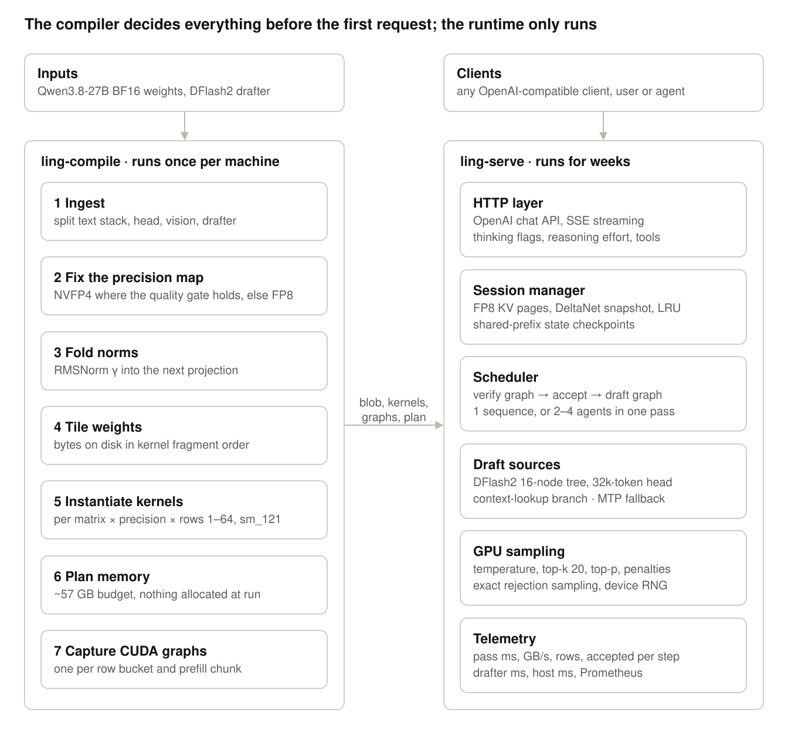
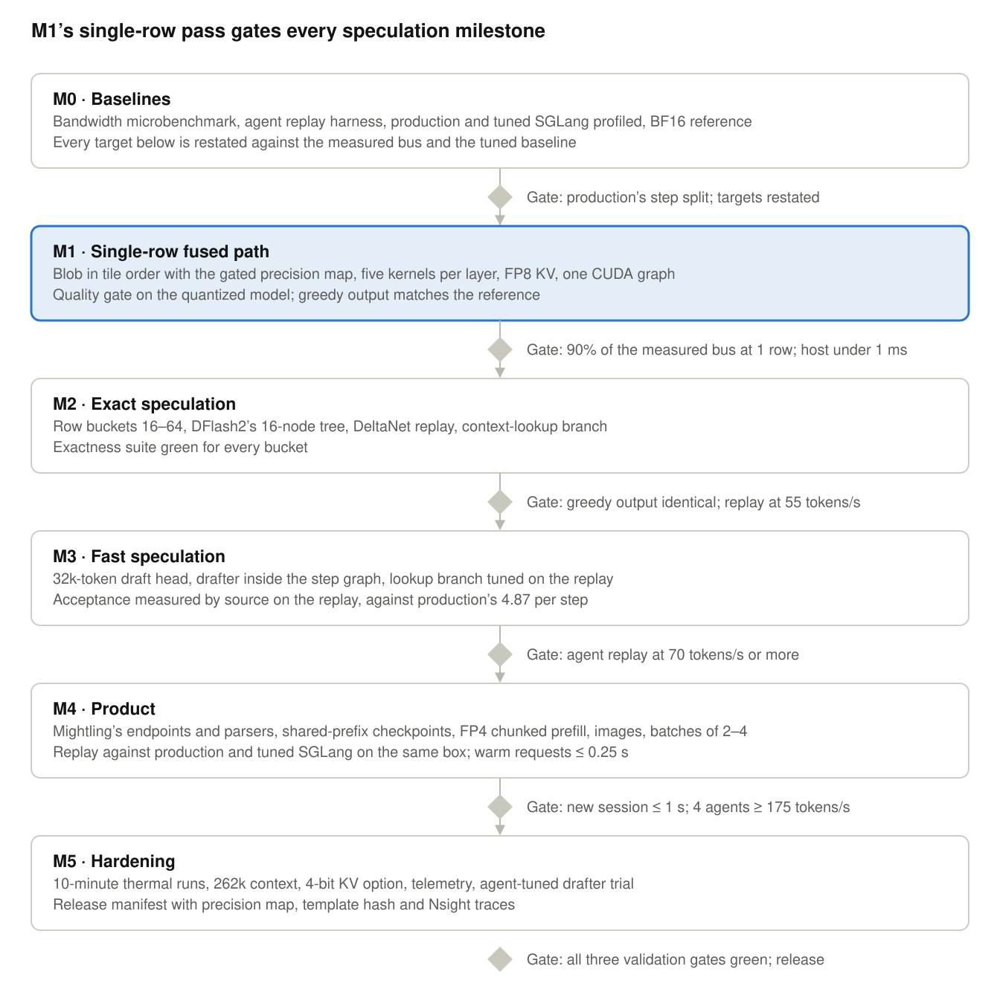

# ling-engine

**A single-model inference engine for Qwen3.8-27B on the NVIDIA DGX Spark (GB10).** Proposed; nothing is built yet.

Decoding Qwen3.8-27B on a DGX Spark is bound by its 273 GB/s memory bus, not by compute: every generated token streams the model's weights (17.6 GB per pass for the checkpoint Mightling serves), which caps plain decoding near 15 tokens/s. Speculation is the only multiplier, and removing everything that is not weight traffic is the other half.

The spec is built on Mightling's measured workload, not a chat benchmark: in 168 recorded agent sessions, 92% of the wall time is the model, a request writes 177 tokens on average (mostly tool-call arguments), and 46% of what the agent writes is copied from its own context. On that workload today's production server (SGLang with the DFlash2 drafter) decodes about 30 tokens/s at ~160 ms per speculative step, against a weight pass that should take about 90 ms.

**Spec:** [SPEC.md](SPEC.md) (8 October 2026) · analysis scripts in [`bench/`](bench/)

## The plan in brief

Two programs: `ling-compile`, an offline compiler that fixes the precision map, folds the norms, lays the weights out on disk in kernel order, instantiates one fused CUDA kernel per matrix shape and captures each decode step as a CUDA graph; and `ling-serve`, a resident runtime that keeps every conversation's KV cache and DeltaNet state on the GPU and serves Mightling as its model server.

Six levers, in order of payoff:

1. **Step time at the bandwidth bound:** fused shape-specialized kernels, one CUDA graph per step, GPU-side sampling, FP8 KV and a DeltaNet replay scheme: ~160 ms per step to 76–90 ms.
2. **A hybrid draft tree:** DFlash2's 16-node tree plus a context-lookup branch in the same verify, because agents copy: 4.87 accepted tokens per step to ≥ 5.8.
3. **New sessions start warm:** DeltaNet checkpoints at shared-prefix boundaries, so a new session's first answer comes in ≤ 1 s instead of ~13 s.
4. **Short requests stay short:** FP4 prefill and no host work before the first pass: 0.68 s of fixed cost per request to ≤ 0.25 s.
5. **Several agents share one weight read:** 2–4 sequences per pass for Night Shift, benchmarks, refine and subagents: ≥ 175 tokens/s aggregate.
6. **An agent-tuned drafter (stretch):** fine-tuned on the user's own sessions, on the Spark, overnight.

**Targets** (estimates until M0 measures the bus and profiles production), single stream on a replay of recorded agent sessions:

| | Production today | Target | Stretch |
| --- | --- | --- | --- |
| Decode on agent output | ~30 tokens/s | ≥ 70 tokens/s (2.3×) | ≥ 100 |
| Mean model time per agent request | ~6.6 s | ≤ 2.8 s | ≤ 2.0 s |
| First answer of a new session | ~13 s | ≤ 1 s | ≤ 0.5 s |
| Agent session wall time | 1× | ≥ 2.1× faster | ≥ 2.8× faster |
| Aggregate decode, 4 agents at once | measured in M0 | ≥ 175 tokens/s | ≥ 220 |

Greedy output stays identical to non-speculative decoding.

## Milestones

## Part of Mightling

This engine is planned as a model server for [Mightling](https://github.com/dreamference/mightling), Dreamference's local, confidential AI for DGX Spark, where Qwen3.8-27B is the default model.

## License

GNU Affero General Public License v3.0 ([LICENSE](LICENSE)), the same as Mightling.
